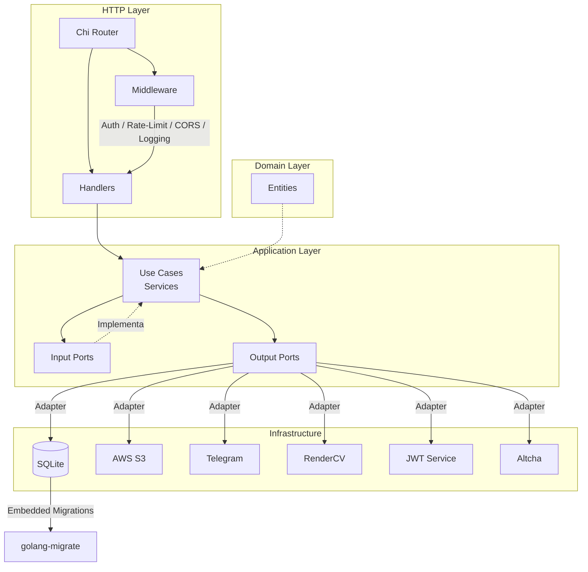

# hv-go-ms-resume

Microservicio REST para gestionar la información del portfolio personal y CV. Implementado en **Go 1.22+** con **arquitectura hexagonal** (Puertos y Adaptadores), migrado desde Spring Boot.

## Arquitectura

El proyecto sigue el patrón de **Arquitectura Hexagonal** (Ports & Adapters), separando claramente el dominio de la infraestructura:

```
cmd/
  server/main.go          # Punto de entrada de la aplicación
  migrate/main.go         # CLI para migración de datos
internal/
  domain/
    entity/               # Entidades de dominio (negocio puro)
  application/
    port/
      input/              # Puertos de entrada (interfaces de casos de uso)
      output/             # Puertos de salida (interfaces de repositorios y servicios externos)
    service/              # Implementación de casos de uso
    dto/
      request/            # DTOs de entrada
      response/           # DTOs de salida
  infrastructure/
    adapter/
      http/               # Adaptadores HTTP (router, handlers, middleware)
        handler/          # Handlers HTTP por recurso
        middleware/       # Middleware (CORS, auth, rate-limit, logging, etc.)
      repository/         # Adaptadores de persistencia (SQLite)
        migrations/       # Migraciones SQL embebidas
      client/             # Clientes para servicios externos (S3, Telegram, RenderCV)
      altcha/             # Proveedor Altcha para anti-spam
    config/               # Configuración y logging
    mapper/               # Mappers entre entidades y DTOs
  migration/              # Utilidad de migración de datos heredados
pkg/
  hashutil/               # Utilidades compartidas (hashing)
api/
  openapi.yaml            # Especificación OpenAPI 3.1
docs/
  specs/                  # Documentación de especificaciones SDD
```



## Tecnologías

| Componente | Tecnología |
|---|---|
| **Lenguaje** | Go 1.22.5 |
| **Router HTTP** | Chi (github.com/go-chi/chi/v5) |
| **Base de datos** | SQLite (modernc.org/sqlite - pure Go) |
| **Migraciones** | golang-migrate/migrate v4 (embebidas) |
| **Autenticación** | JWT (golang-jwt/jwt/v5) + bcrypt |
| **Rate Limiting** | Token bucket (golang.org/x/time/rate) |
| **Anti-spam** | Altcha (github.com/altcha-org/altcha-lib-go) |
| **Cloud Storage** | AWS SDK Go v2 (S3) |
| **PDF** | RenderCV (servicio externo) |
| **Notificaciones** | Telegram Bot API |

## Requisitos

- Go 1.22.5 o superior
- (Opcional) Docker y Docker Compose
- Acceso a AWS S3 (para caché de PDF)
- Servicio RenderCV (para generación de PDF)
- Bot de Telegram (para notificaciones de contacto)

## Configuración

### Variables de Entorno

Todas las variables se configuran mediante variables de entorno. Copia el archivo de ejemplo y ajústalo:

```bash
cp .env.example .env
```

| Variable | Obligatoria | Default | Descripción |
|---|---|---|---|
| **Servidor** | | | |
| `PORT` | No | `8080` | Puerto del servidor HTTP |
| `APP_VERSION` | No | `1.0.0` | Versión de la aplicación |
| **Autenticación** | | | |
| `JWT_SECRET` | Si | - | Clave secreta para firmar JWT (256-bit recomendado) |
| `JWT_EXPIRATION_HOURS` | No | `24` | Horas de validez del token JWT |
| `ADMIN_USERNAME` | Si | - | Nombre de usuario administrador |
| `ADMIN_PASSWORD_HASH` | Si | - | Hash bcrypt de la contraseña del administrador |
| **Base de datos** | | | |
| `DATABASE_PATH` | No | `./data/resume.db` | Ruta al archivo SQLite |
| **AWS S3** | | | |
| `AWS_ACCESS_KEY_ID` | Si | - | Access Key de AWS |
| `AWS_SECRET_ACCESS_KEY` | Si | - | Secret Key de AWS |
| `AWS_REGION` | Si | - | Región de AWS |
| `AWS_BUCKET` | Si | - | Bucket S3 para caché de PDF |
| **RenderCV** | | | |
| `RENDER_CV_URL` | Si | - | URL del servicio RenderCV |
| **Telegram** | | | |
| `TELEGRAM_BOT_TOKEN` | Si | - | Token del bot de Telegram |
| `TELEGRAM_CHAT_ID` | Si | - | ID del chat para notificaciones |
| **Logging** | | | |
| `LOG_LEVEL` | No | `info` | Nivel de log (debug, info, warn, error) |
| **Rate Limiting** | | | |
| `RATE_LIMIT_PUBLIC` | No | `100` | Requests/minuto para endpoints públicos |
| `RATE_LIMIT_LOGIN` | No | `5` | Requests/minuto para login |
| `RATE_LIMIT_AUTHENTICATED` | No | `200` | Requests/minuto para endpoints autenticados |

### Generar Hash de Contraseña

Para generar el hash bcrypt de la contraseña del administrador:

```bash
go run pkg/hashutil/hash.go <tu-contraseña>
```

O usando la herramienta de migración:

```bash
go run cmd/migrate/main.go hash <tu-contraseña>
```

## Instalación y Ejecución Local

### Desarrollo

```bash
# Clonar el repositorio
git clone https://github.com/cristiansrc/hv-go-ms-resume.git
cd hv-go-ms-resume

# Copiar y configurar variables de entorno
cp .env.example .env
# Editar .env con tus valores

# Descargar dependencias
go mod download

# Ejecutar en modo desarrollo (con recarga)
go run ./cmd/server

# O compilar y ejecutar
go build -o server ./cmd/server
./server
```

### Docker

```bash
# Construir imagen
docker build -t hv-go-ms-resume .

# Ejecutar contenedor
docker run -p 8080:8080 --env-file .env hv-go-ms-resume
```

### Health Check

```bash
curl http://localhost:8080/health
```

Respuesta esperada:

```json
{
  "status": "healthy",
  "timestamp": "2026-01-15T10:30:00Z",
  "version": "1.0.0"
}
```

## API

La especificación completa está disponible en [`api/openapi.yaml`](api/openapi.yaml) (OpenAPI 3.1).

### Base URL

- Desarrollo: `http://localhost:8080`
- Producción: `https://api.cristiansrc.com`

### Prefijo de rutas

Todas las rutas de negocio usan el prefijo `/v1/ms-resume`.

### Endpoints

#### Salud

| Método | Ruta | Descripción |
|---|---|---|
| `GET` | `/health` | Health check del servicio |

#### Públicos (sin autenticación)

| Método | Ruta | Descripción |
|---|---|---|
| `GET` | `/v1/ms-resume/public/info-page` | Información completa de la página |
| `GET` | `/v1/ms-resume/public/curriculum/{language}` | Descargar CV en PDF |
| `POST` | `/v1/ms-resume/public/contact` | Enviar formulario de contacto |
| `GET` | `/v1/ms-resume/public/challenge` | Obtener challenge Altcha |
| `GET` | `/v1/ms-resume/public/blog` | Listar blogs públicos |
| `GET` | `/v1/ms-resume/public/blog/{id}` | Obtener blog por ID |
| `GET` | `/v1/ms-resume/public/blog-type` | Listar tipos de blog |
| `GET` | `/v1/ms-resume/public/blog-type/{id}` | Obtener tipo de blog |
| `GET` | `/v1/ms-resume/public/templates` | Listar templates de CV |
| `GET` | `/v1/ms-resume/public/languages` | Listar idiomas |
| `GET` | `/v1/ms-resume/public/courses` | Listar cursos públicos |
| `GET` | `/v1/ms-resume/public/certifications` | Listar certificaciones públicas |
| `GET` | `/v1/ms-resume/public/languages-data` | Datos de idiomas |
| `GET` | `/v1/ms-resume/public/references` | Listar referencias |
| `GET` | `/v1/ms-resume/public/custom-sections` | Secciones personalizadas |

#### Autenticación

| Método | Ruta | Descripción |
|---|---|---|
| `POST` | `/v1/ms-resume/login` | Iniciar sesión (obtener JWT) |

#### Protegidos (requieren JWT)

Cada recurso CRUD expone los siguientes endpoints:

| Método | Ruta | Descripción |
|---|---|---|
| `GET` | `/v1/ms-resume/{recurso}` | Listar todos |
| `GET` | `/v1/ms-resume/{recurso}/{id}` | Obtener por ID |
| `POST` | `/v1/ms-resume/{recurso}` | Crear |
| `PUT` | `/v1/ms-resume/{recurso}/{id}` | Actualizar |
| `DELETE` | `/v1/ms-resume/{recurso}/{id}` | Eliminar |

Recursos disponibles:
- `basic-data` (solo GET/{id}, PUT/{id})
- `home` (solo GET/{id}, PUT/{id})
- `label`, `image-url`, `video-url`, `blog`, `blog-type`
- `skill-type`, `skill`, `skill-son`
- `experience`, `education`, `futured-project`
- `course`, `certification`, `language`, `reference`, `custom-section`

### Autenticación

Para endpoints protegidos, incluir el token JWT en el header:

```
Authorization: Bearer <token>
```

**Ejemplo de login:**

```bash
curl -X POST http://localhost:8080/v1/ms-resume/login \
  -H "Content-Type: application/json" \
  -d '{
    "username": "admin",
    "password": "tu-contraseña",
    "altcha_payload": "...",
    "altcha_signature": "..."
  }'
```

**Respuesta:**

```json
{
  "token": "eyJhbGciOiJIUzI1NiIs..."
}
```

### Formato de Errores

Todos los errores siguen una estructura uniforme:

```json
{
  "timestamp": "2026-01-15T10:30:00Z",
  "status": 401,
  "error": "Unauthorized",
  "code": "UNAUTHORIZED",
  "message": "Invalid or expired token",
  "path": "/v1/ms-resume/basic-data/1",
  "trace_id": "req-uuid-1234",
  "details": null
}
```

| Código | Significado |
|---|---|
| `UNAUTHORIZED` | Token faltante, inválido o expirado |
| `RATE_LIMIT_EXCEEDED` | Límite de tasa excedido |
| `BAD_REQUEST` | Solicitud mal formada |
| `NOT_FOUND` | Recurso no encontrado |
| `INTERNAL_ERROR` | Error interno del servidor |

## Base de Datos

### SQLite

El proyecto usa **SQLite** como base de datos embebida, con las siguientes características:

- WAL mode (`journal_mode=WAL`) para mejor concurrencia
- `busy_timeout=5000` para evitar bloqueos
- `foreign_keys=ON` para integridad referencial
- Máximo 1 conexión concurrente (por limitación de SQLite)

### Migraciones

Las migraciones están embebidas en el binario y se aplican automáticamente al iniciar:

```
internal/infrastructure/adapter/repository/migrations/
  001_initial_schema.up.sql
  001_initial_schema.down.sql
  002_new_entities.up.sql
  002_new_entities.down.sql
```

### Tablas

- **Datos personales:** `basic_data`
- **Portfolio:** `home`, `label`, `image_url`, `video_url`, `blog`, `blog_type`
- **Habilidades:** `skill_type`, `skill`, `skill_son`
- **Experiencia:** `experience`, `education`, `futured_project`
- **Formación:** `course`, `certification`
- **Idiomas:** `language`
- **Referencias:** `reference`, `custom_section`
- **Soporte:** `user_credentials`, `pdf_cache`
- **Join:** `home_label`, `skill_type_skill`, `skill_skill_son`, `experience_skill_son`

## Integraciones

### AWS S3

- **Propósito:** Almacenamiento en caché de PDFs generados
- **Fallback:** Si S3 no está disponible, la generación de PDF continúa sin caché

### RenderCV

- **Propósito:** Servicio externo para generación de PDF del CV
- **Formato:** Envía datos estructurados y recibe el PDF generado

### Telegram

- **Propósito:** Notificaciones al administrador cuando alguien usa el formulario de contacto

### Altcha

- **Propósito:** Anti-spam para el formulario de contacto y login
- **Mecanismo:** Challenge-response del lado del servidor

## Pruebas

```bash
# Ejecutar todas las pruebas
go test ./...

# Con cobertura
go test -coverprofile=coverage.out ./...
go tool cover -html=coverage.out -o coverage.html

# Pruebas de handlers específicos
go test ./internal/infrastructure/adapter/http/handler/...
```

## Despliegue

### Docker

```bash
# Construir
docker build -t hv-go-ms-resume:latest .

# Ejecutar
docker run -d \
  --name hv-go-ms-resume \
  -p 8080:8080 \
  -v /data:/app/data \
  --env-file .env \
  hv-go-ms-resume:latest
```

### Producción

La imagen Docker usa `gcr.io/distroless/base-debian12:nonroot` como base para minimizar la superficie de ataque. El binario compilado estáticamente con `CGO_ENABLED=0` y `-ldflags="-s -w"`.

## Estructura del Proyecto

```
hv-go-ms-resume/
├── api/
│   └── openapi.yaml          # Especificación OpenAPI 3.1
├── cmd/
│   ├── migrate/              # CLI para migración de datos
│   └── server/               # Punto de entrada del servidor
│       └── main.go
├── docs/
│   └── specs/                # Especificaciones SDD
├── internal/
│   ├── application/
│   │   ├── dto/              # Data Transfer Objects
│   │   ├── port/             # Puertos (interfaces)
│   │   └── service/          # Casos de uso
│   ├── domain/
│   │   └── entity/           # Entidades de dominio
│   ├── infrastructure/
│   │   └── adapter/
│   │       ├── altcha/       # Anti-spam
│   │       ├── client/       # Clientes externos (S3, Telegram, RenderCV)
│   │       ├── http/         # Router, handlers, middleware
│   │       └── repository/   # Persistencia SQLite + migraciones
│   └── migration/            # Migración de datos heredados
├── pkg/
│   └── hashutil/             # Utilidades compartidas
├── .env.example              # Plantilla de variables de entorno
├── .gitignore
├── Dockerfile
├── go.mod
├── go.sum
└── README.md
```

## Licencia

Este proyecto es de uso personal. Todos los derechos reservados.
